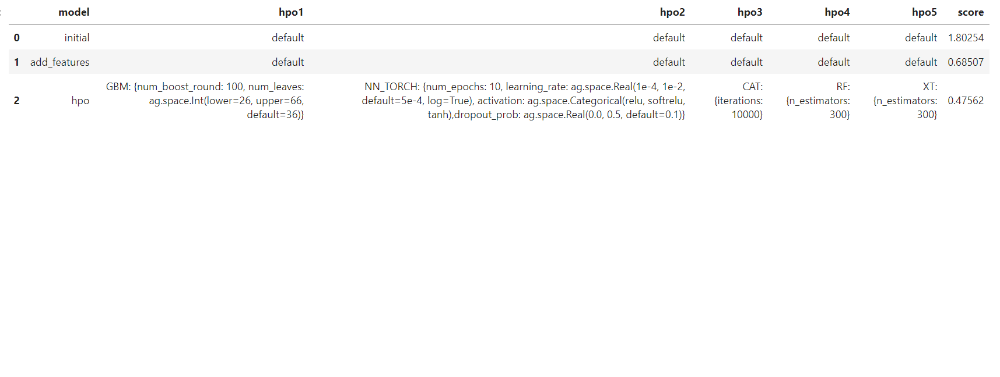
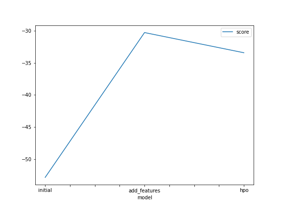
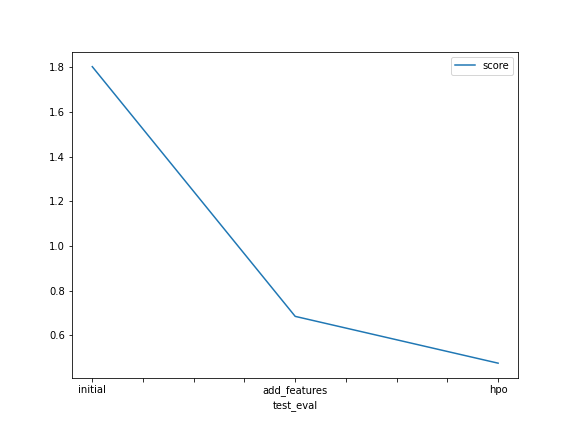

# Report: Predict Bike Sharing Demand with AutoGluon Solution
#### Andrea Nadali

## Initial Training
### What did you realize when you tried to submit your predictions? What changes were needed to the output of the predictor to submit your results?
I realized the predictions alone were not enough and I needed to join them with the datetime.

### What was the top ranked model that performed?
WeightedEnsemble_L3  

## Exploratory data analysis and feature creation
### What did the exploratory analysis find and how did you add additional features?
I realized that in the second step the feature engineer had a great contribution to the success of the prediction.
In details, I started just extarpolating the month as a new feature but I soon realized that those features will gonna play a big role in the overall score of my models.
I ended up generating not only hour, day and month but I also generated an year column in the df. 

### How much better did your model preform after adding additional features and why do you think that is?
The score of the top model improved more than 20 points and I think it's because the datetime column (even if parsed correctly) adds not that much to the models.
Splitting its componenet though enables the models to have additional features in the iterations that can actually understand, test and use overall to predict new values.
For example, the models can understand that 16:00 is way different than 23:00, 31-12-2011 is different than 9-11-2011 etc...

## Hyper parameter tuning
### How much better did your model preform after trying different hyper parameters?
Actually it performed worse by 3 points

### If you were given more time with this dataset, where do you think you would spend more time?
I think I'd have spent more time in trying different hyper parameters to tru to improve the model :)

### Create a table with the models you ran, the hyperparameters modified, and the kaggle score.

### Create a line plot showing the top model score for the three (or more) training runs during the project.

### Create a line plot showing the top kaggle score for the three (or more) prediction submissions during the project.

## Summary
In brief, I'd say autogluon showed it's power in predicting bike sharing demand using several models. The prediction score improve significantly after some EDA and especially some feature engeener whereas I was not so lucky with the hyper parameters tuning even though I had the chance to see a bit closer how this is working. To crack the project I had also to get familizarized a bit with documantion and overall I'd say I'm pretty excited for the results and loking forward for the next challenge! 
